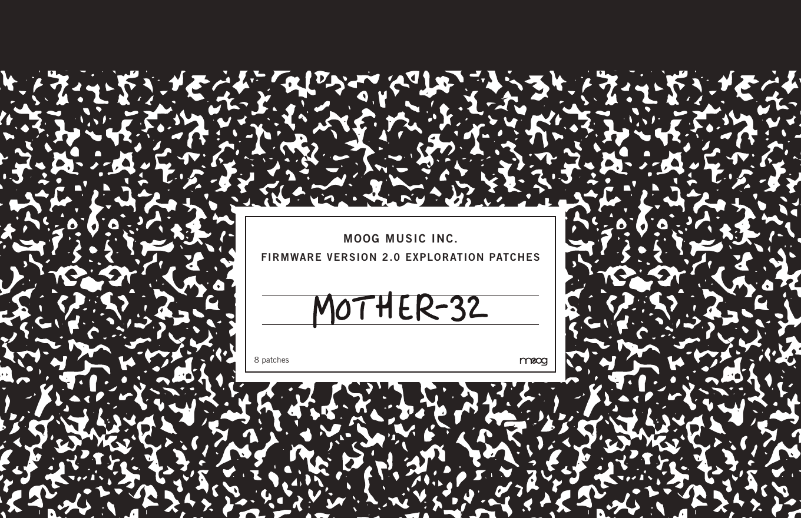
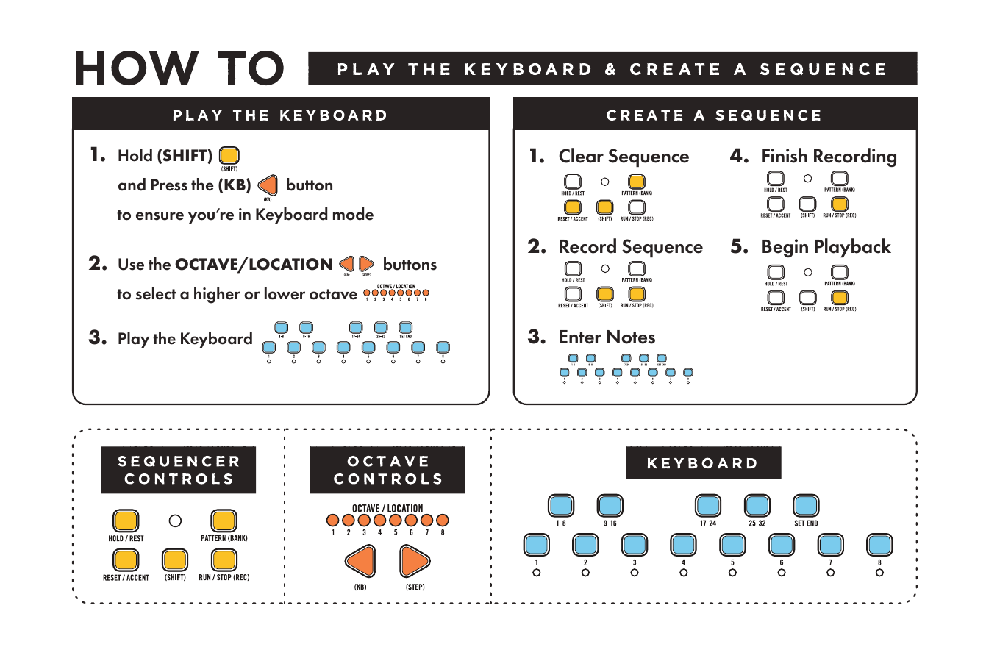
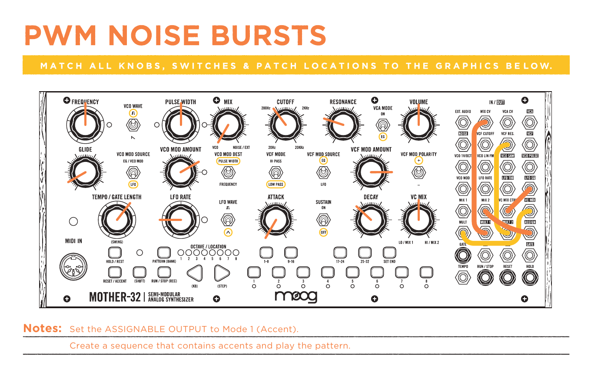
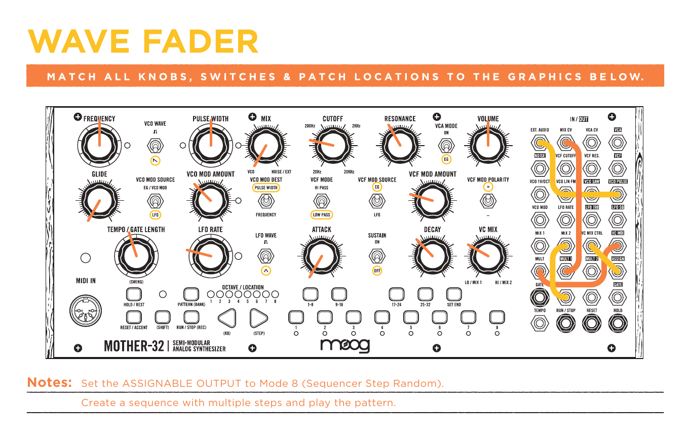
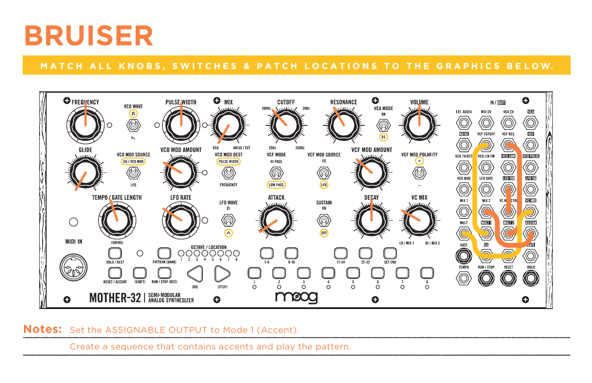
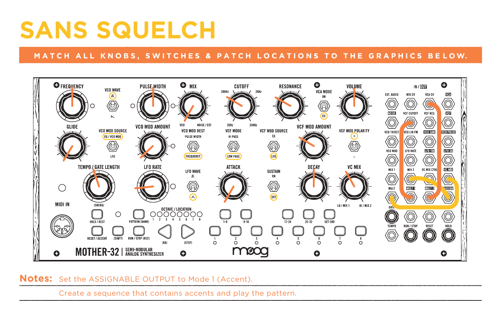
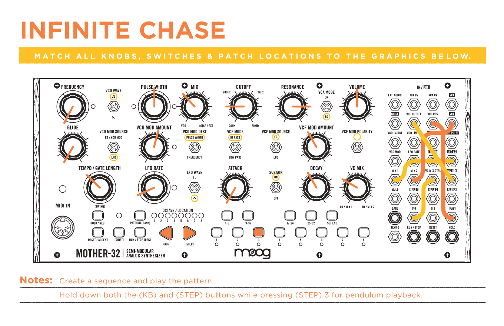
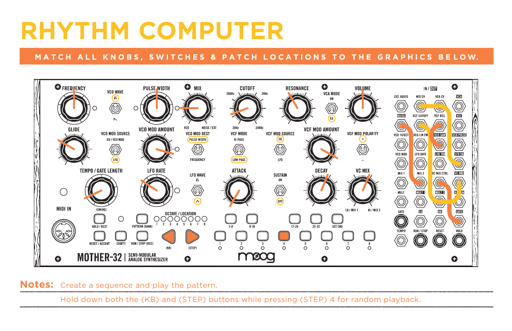
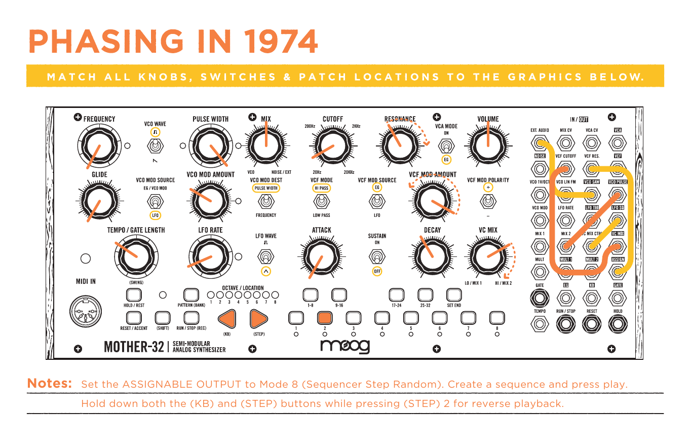
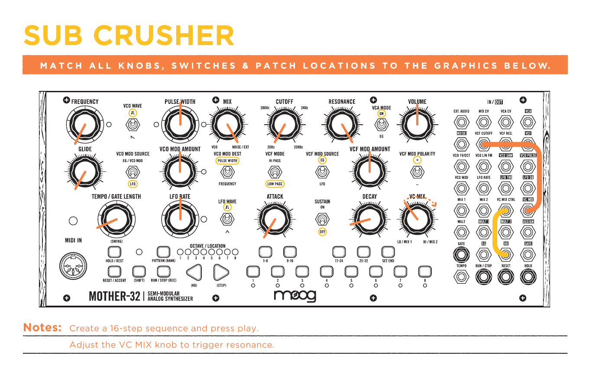

# Mother-32 Firmware Version 2.0 Exploration Patches

Moog Music Inc.

8 patches

## Moog Music

Moog Music is an employee-owned company based in Asheville, NC.

Synthesize Love.

## How To: Play the Keyboard & Create a Sequence

### Play the Keyboard

1. Hold `(SHIFT)` and press the `(KB)` button to ensure you are in Keyboard mode.
2. Use the OCTAVE/LOCATION buttons to select a higher or lower octave.
3. Play the keyboard.

### Create a Sequence

1. Clear Sequence.
2. Record Sequence.
3. Enter Notes.
4. Finish Recording.
5. Begin Playback.

## Patch 1: PWM Noise Bursts

Match all knobs, switches, and patch locations to the graphic below.

Notes:

- Set the ASSIGNABLE OUTPUT to Mode 1 (Accent).
- Create a sequence that contains accents and play the pattern.

## Patch 2: Wave Fader

Match all knobs, switches, and patch locations to the graphic below.

Notes:

- Set the ASSIGNABLE OUTPUT to Mode 8 (Sequencer Step Random).
- Create a sequence with multiple steps and play the pattern.

## Patch 3: Bruiser

Match all knobs, switches, and patch locations to the graphic below.

Notes:

- Set the ASSIGNABLE OUTPUT to Mode 1 (Accent).
- Create a sequence that contains accents and play the pattern.

## Patch 4: Sans Squelch

Match all knobs, switches, and patch locations to the graphic below.

Notes:

- Set the ASSIGNABLE OUTPUT to Mode 1 (Accent).
- Create a sequence that contains accents and play the pattern.

## Patch 5: Infinite Chase

Match all knobs, switches, and patch locations to the graphic below.

Notes:

- Create a sequence and play the pattern.
- Hold down both the `(KB)` and `(STEP)` buttons while pressing `(STEP) 3` for pendulum playback.

## Patch 6: Rhythm Computer

Match all knobs, switches, and patch locations to the graphic below.

Notes:

- Create a sequence and play the pattern.
- Hold down both the `(KB)` and `(STEP)` buttons while pressing `(STEP) 4` for random playback.

## Patch 7: Phasing in 1974

Match all knobs, switches, and patch locations to the graphic below.

Notes:

- Set the ASSIGNABLE OUTPUT to Mode 8 (Sequencer Step Random).
- Create a sequence and press play.
- Hold down both the `(KB)` and `(STEP)` buttons while pressing `(STEP) 2` for reverse playback.

## Patch 8: Sub Crusher

Match all knobs, switches, and patch locations to the graphic below.

Notes:

- Create a 16-step sequence and press play.
- Adjust the VC MIX knob to trigger resonance.

## More Sonic Explorations

Visit <https://www.moogmusic.com> for more sonic explorations.

